# AI Learning Coach

Welcome to your **AI Learning Coach**! This project is an intelligent studying companion designed to help you master any new topic through structured planning, active recall, and personalized assessments.

## 🎯 Purpose

The goal of this project is to act as an automated, full-cycle learning assistant. It starts by taking a topic you want to learn, creating a custom curriculum (SMART goal), generating study materials (Anki flashcards), and continuously testing your knowledge to ensure you are ready to advance to the next level.

## 🤖 The Agents

The system is powered by four specialized AI agents, each handling a specific phase of the learning lifecycle:

1.  **GoalAgent** (`src/agents/goal_agent.py`):
    *   **Role**: The Planner.
    *   **Function**: Takes your broad topic (e.g., "Quantum Physics") and converts it into a concrete, 30-day SMART learning plan.
    *   **Output**: A structured schedule with milestones and estimated timeframes.

2.  **DiagnosticAgent** (`src/agents/diagnostic_agent.py`):
    *   **Role**: The Assessor.
    *   **Function**: Before you start, it generates a diagnostic quiz to check your current knowledge level.
    *   **Utility**: Helps establish a baseline so you know where you stand.

3.  **OptimizerAgent** (`src/agents/optimizer_agent.py`):
    *   **Role**: The content Creator.
    *   **Function**: For each milestone, it generates high-quality study materials, specifically formatted for *Spaced Repetition*.
    *   **Output**: Creates ready-to-import Anki Flashcard packages (`.apkg`).

4.  **ExaminerAgent** (`src/agents/examiner_agent.py`):
    *   **Role**: The Teacher.
    *   **Function**: After your study period, it creates a challenging exam for the current milestone. It grades your answers, provides feedback, and decides if you have passed or need to review.
    *   **Feature**: Includes *Active Recall* questions from previous milestones to ensure long-term retention.

## 🚀 How to Run the Code

### Prerequisites
*   Python 3.8+
*   A Google Cloud Project with Gemini API access.
*   An API Key saved in a `.env` file.

### Installation

1.  Clone the repository.
2.  Install dependencies:
    ```bash
    pip install -r requirements.txt
    ```
3.  Set up your environment variables:
    *   Create a `.env` file in the root directory.
    *   Add your API key:
        ```env
        GOOGLE_API_KEY=your_api_key_here
        ```

### Running the Application

Execute the main script from the root directory:

```bash
python src/main.py
```

Follow the on-screen prompts to enter your learning topic and interact with the coach.

## 🏗️ System Architecture

```mermaid
graph TD

    %% Nodes
    User([User 👤])
    GoalAgent[GoalAgent 🎯]
    DiagnosticAgent[DiagnosticAgent 🩺]
    OptimizerAgent[OptimizerAgent ⚡]
    ExaminerAgent[ExaminerAgent 📝]
    Memory[(Memory / State 🧠)]
    AnkiFile(Anki Deck .apkg 📦)

    %% Flow
    User -- "1. Wants to learn Topic" --> GoalAgent
    GoalAgent -- "2. Creates Learning Plan" --> Memory
    
    GoalAgent -- "Plan" --> DiagnosticAgent
    DiagnosticAgent -- "3. Generates Quiz" --> User
    User -- "Answers" --> DiagnosticAgent
    DiagnosticAgent -- "Updates Profile" --> Memory

    Memory -- "Current Milestone" --> OptimizerAgent
    OptimizerAgent -- "4. Generates Materials" --> AnkiFile
    AnkiFile -.-> User
    
    User -- "5. Studies (3 Days)" --> User
    
    User -- "6. Request Exam" --> ExaminerAgent
    Memory -- "Context" --> ExaminerAgent
    ExaminerAgent -- "7. Generates Exam" --> User
    User -- "Answers" --> ExaminerAgent
    ExaminerAgent -- "8. Grades & Updates State" --> Memory

    %% Styling
    style GoalAgent fill:#e1f5fe,stroke:#01579b,stroke-width:2px
    style DiagnosticAgent fill:#f3e5f5,stroke:#4a148c,stroke-width:2px
    style OptimizerAgent fill:#e8f5e9,stroke:#1b5e20,stroke-width:2px
    style ExaminerAgent fill:#fff3e0,stroke:#e65100,stroke-width:2px
    style Memory fill:#fff9c4,stroke:#fbc02d,stroke-width:2px
```


<details>
<summary>Mermaid Diagram (Text-based)</summary>


</details>

## 🧠 Memory & State Management

The project uses a simple file-based persistence system to maintain state between sessions.

*   **Location**: All state is stored in the `.coin_cache` directory.
*   **Structure**: Each learning project has its own dedicated subdirectory inside `.coin_cache` (e.g., `.coin_cache/learn_quantum_physics`).
*   **Mechanism**: The `MemoryManager` class (`src/memory.py`) serializes the internal Pydantic models to JSON files.
*   **Files**:
    *   `learning_goal.json`: Stores the current active SMART goal and its milestones.
    *   `user_profile.json`: Tracks the user's progress, including completed milestones, assessment history, and concept mastery levels.

This structure allows you to maintain **multiple independent learning projects**. On startup, the system will ask if you want to continue an existing project or start a new one. It also automatically attempts to migrate any legacy data from the root `.coin_cache` folder into a project-specific folder.

## 📦 Anki Packages

When the **OptimizerAgent** generates study materials, it saves them as Anki Package files (`.apkg`) directly in the **root directory** of the project.

**Naming Convention:** `deck_Milestone_Title.apkg`

**How to use:**
1.  Locate the `.apkg` file in the project folder.
2.  Double-click the file to import it into your [Anki](https://apps.ankiweb.net/) desktop application.
3.  Study the cards for the recommended duration before taking the exam.


**DISCLAIMER:**
The code was vibe-coded at >90% using Gemini 3.0 and Antigravity.
Use at your own risk.
