# AI Learning Coach

Welcome to your **AI Learning Coach**! This project is an intelligent studying companion designed to help you master any new topic through structured planning, active recall, and personalized assessments.

## 🎯 Purpose

The goal of this project is to act as an automated, full-cycle learning assistant. It starts by taking a topic you want to learn, creating a custom curriculum (SMART goal), generating study materials (Anki flashcards), and continuously testing your knowledge to ensure you are ready to advance to the next level.

## 📁 Project Structure

This monorepo contains three main components:

| Component | Description | Location |
|-----------|-------------|----------|
| **Python CLI** | Core AI agent engine with command-line interface | [`src/`](src/) |
| **Backend API** | FastAPI server for the mobile app | [`backend/`](backend/) |
| **iOS App** | SwiftUI app for iPhone, iPad, and Mac | [`ios/`](ios/) |

```
ai-learning-coach/
├── src/                 # Python CLI & AI Agents
│   ├── agents/          # GoalAgent, DiagnosticAgent, OptimizerAgent, ExaminerAgent
│   ├── main.py          # CLI entry point
│   └── ...
├── backend/             # FastAPI backend for iOS app
│   ├── main.py          # API endpoints
│   └── requirements.txt
├── ios/                 # SwiftUI iOS/iPadOS/macOS app
│   ├── AILearningCoach/
│   └── AILearningCoach.xcodeproj
├── prompts/             # System prompts for AI agents
├── figures/             # Architecture diagrams and images
└── .coin_cache/         # Learning project data (git-ignored)
```

## 🤖 The Agents

The system is powered by four specialized AI agents. See [`src/README.md`](src/README.md) for detailed documentation.

| Agent | Role | Function |
|-------|------|----------|
| **GoalAgent** | 🎯 Planner | Creates a 30-day SMART learning plan |
| **DiagnosticAgent** | 🩺 Assessor | Generates diagnostic quizzes |
| **OptimizerAgent** | ⚡ Content Creator | Generates Anki flashcards |
| **ExaminerAgent** | 📝 Teacher | Creates exams & provides feedback |

## 🏗️ System Architecture

```mermaid
graph TD

    %% Nodes
    User([User 👤])
    GoalAgent[GoalAgent 🎯]
    DiagnosticAgent[DiagnosticAgent 🩺]
    OptimizerAgent[OptimizerAgent ⚡]
    ExaminerAgent[ExaminerAgent 📝]
    Memory[(Memory / State 🧠)]
    AnkiFile(Anki Deck .apkg 📦)

    %% Flow
    User -- "1. Wants to learn Topic" --> GoalAgent
    GoalAgent -- "2. Creates Learning Plan" --> Memory
    
    GoalAgent -- "Plan" --> DiagnosticAgent
    DiagnosticAgent -- "3. Generates Quiz" --> User
    User -- "Answers" --> DiagnosticAgent
    DiagnosticAgent -- "Updates Profile" --> Memory

    Memory -- "Current Milestone" --> OptimizerAgent
    OptimizerAgent -- "4. Generates Materials" --> AnkiFile
    AnkiFile -.-> User
    
    User -- "5. Studies (3 Days)" --> User
    
    User -- "6. Request Exam" --> ExaminerAgent
    Memory -- "Context" --> ExaminerAgent
    ExaminerAgent -- "7. Generates Exam" --> User
    User -- "Answers" --> ExaminerAgent
    ExaminerAgent -- "8. Grades & Updates State" --> Memory

    %% Styling
    style GoalAgent fill:#e1f5fe,stroke:#01579b,stroke-width:2px
    style DiagnosticAgent fill:#f3e5f5,stroke:#4a148c,stroke-width:2px
    style OptimizerAgent fill:#e8f5e9,stroke:#1b5e20,stroke-width:2px
    style ExaminerAgent fill:#fff3e0,stroke:#e65100,stroke-width:2px
    style Memory fill:#fff9c4,stroke:#fbc02d,stroke-width:2px
```


<details>
<summary>Mermaid Diagram (Text-based)</summary>


</details>

---

## 🚀 Getting Started

### Prerequisites

*   Python 3.8+
*   A Google Cloud Project with Gemini API access
*   An API Key saved in a `.env` file

### Installation

1.  Clone the repository.
2.  Install dependencies:
    ```bash
    pip install -r requirements.txt
    ```
3.  Set up your environment variables:
    *   Create a `.env` file in the root directory.
    *   Add your API key:
        ```env
        GOOGLE_API_KEY=your_api_key_here
        ```

---

## 💻 Python CLI

The CLI provides direct access to the AI agents through an interactive terminal interface.

```bash
python src/main.py
```

Follow the on-screen prompts to enter your learning topic and interact with the coach.

See [`src/README.md`](src/README.md) for more details on the agents and memory management.

---

## 📱 iOS / iPadOS / macOS App

A beautiful SwiftUI app that provides the same learning experience on Apple devices.

### Features

*   📚 **Flashcard Study** - SM-2 spaced repetition algorithm with offline support
*   🩺 **Diagnostic Mode** - AI-graded knowledge assessments
*   📝 **Examiner Mode** - Milestone assessments with 80% pass threshold

### Running the App

1.  **Start the backend server:**
    ```bash
    cd backend
    pip install -r requirements.txt
    uvicorn main:app --reload --host 0.0.0.0 --port 8000
    ```

2.  **Open the iOS project in Xcode:**
    ```
    ios/AILearningCoach.xcodeproj
    ```

3.  Select your target device and run (Cmd + R)

See [`ios/README.md`](ios/README.md) for detailed iOS documentation.

---

## 📦 Anki Packages

When the **OptimizerAgent** generates study materials, it saves them as Anki Package files (`.apkg`) directly in the **root directory** of the project.

**Naming Convention:** `deck_Milestone_Title.apkg`

**How to use:**
1.  Locate the `.apkg` file in the project folder.
2.  Double-click the file to import it into your [Anki](https://apps.ankiweb.net/) desktop application.
3.  Study the cards for the recommended duration before taking the exam.

---

## 📄 License

This project is for personal learning purposes.

---

**DISCLAIMER:**
The code was vibe-coded at >90% using Gemini 3.0 and Antigravity.
Use at your own risk.
